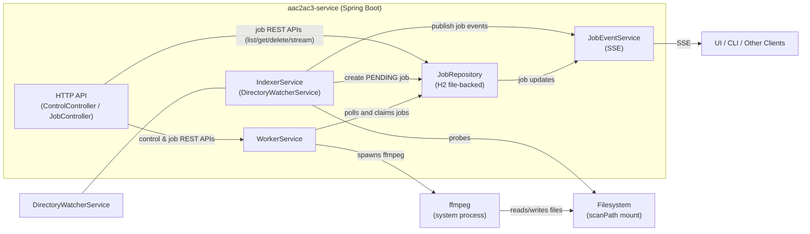
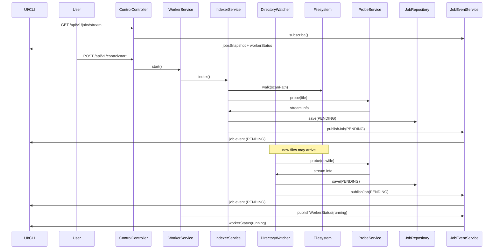
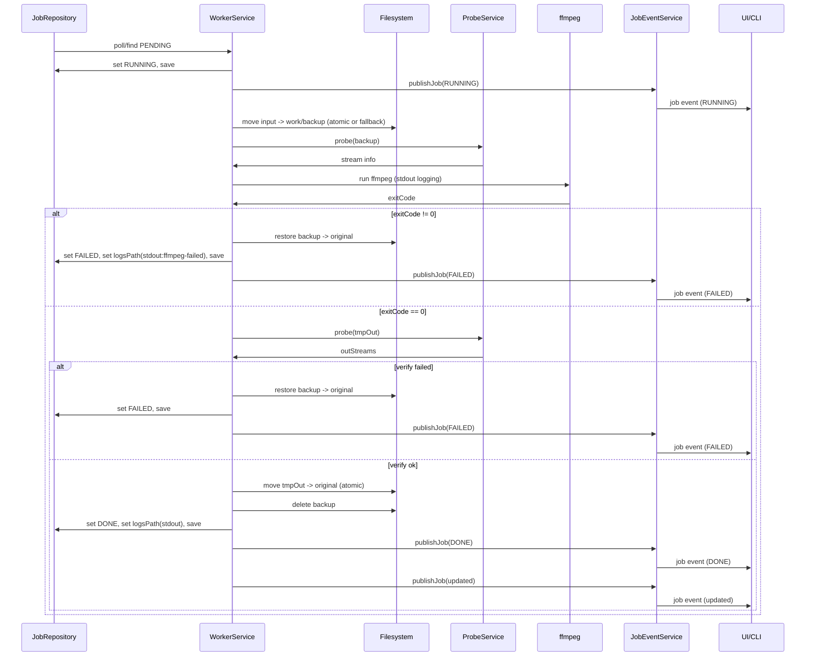
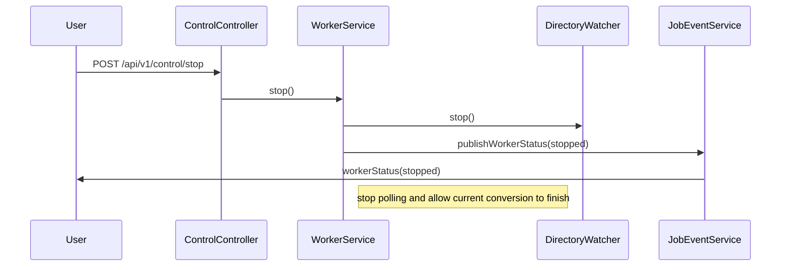
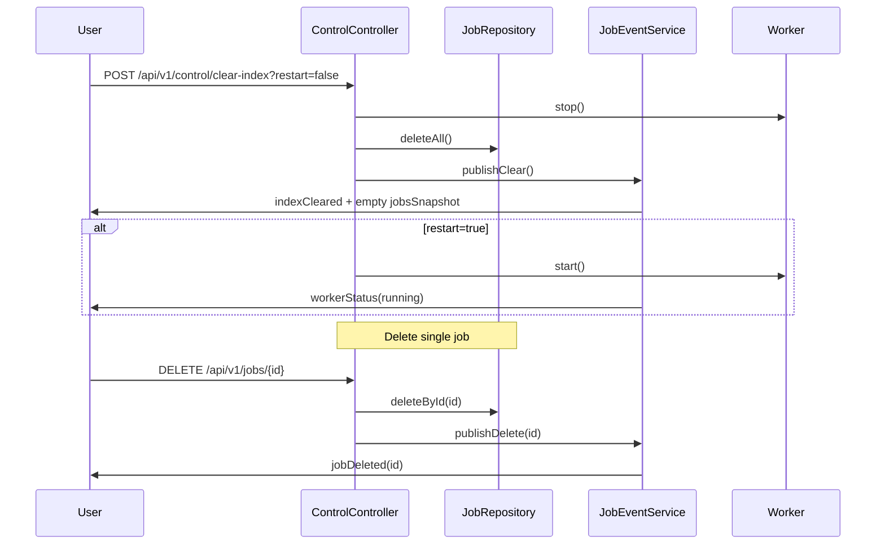

# aac2ac3-service

Motivation

Modern HI FI movie audio receivers can't process AAC 5.1 codec multi-channel audio, so if you have video files in MKV container with audio like you cant enjoy them in multi-channel way, left stranded to hear them in stereo sound. This service resolves that transcoding the AAC audio codec to AC3, which modern multi-channel HI FI systems understand.
So, in synthesis, this a service that detects MKV files with AAC audio from a directory (it can be local or a remote Samba directory) and converts AAC audio tracks to AC3 using ffmpeg and leaving untouched subtitles, other non AAC tracks and specially, the video track inside the MKV container.

Summary
- Recursively probe a configured directory for MKV files that contain AAC audio.
- Index matching files in a persistent job table and process them with a worker.
- Safe replace: originals are renamed to a backup (`<basename>AAC.mkv` or `.bak.mkv`), conversion writes a `.tmp.mkv` and is atomically moved into place on success.
- SMB reliability mode: for `smb://` jobs the worker uses SMBJ to rename/download/upload files, while `ffmpeg` runs only on local `work/` files to avoid direct `ffmpeg smb://` instability.
- Exposes REST control and job APIs (start/stop/status/clear-index + create/list/delete jobs).
- Persistence: file-backed H2 (default `data/aac2ac3.mv.db`) to avoid reprocessing after restarts.

This repository contains three separate usage guides:

- `README.jvm.md` — how to build and run on the JVM (local/server).

- `README.native.md` — how to build a native amd64 binary (GraalVM/native-image path).
- `README.arm64.md` — ARM64 / Raspberry Pi build & deployment (Docker and Paketo/native options).

See those files for the full build and run instructions.

Architecture (Mermaid)



Components
- `ControlController` — start/stop/status/clear-index endpoints.
- `JobController` — create/list/delete job records.
- `IndexerService` — recursively probes `index.scanPath` for `.mkv` files containing AAC audio and creates `PENDING` jobs.
- `WorkerService` — claims `PENDING` jobs and runs the conversion pipeline (rename -> ffmpeg -> verify -> replace).
- `SambaService` — SMBJ-based directory listing, rename/delete, and file transfer used by scanner and SMB conversion flow.
- `FfmpegCommandBuilder` / `FfmpegRunner` — build and run the ffmpeg command line.


Mermaid sequence diagrams

Client subscription, start & indexing



Conversion flow (per job)



Stop flow



Clear index & delete flows



Configuration & environment variables

You can configure the application using `src/main/resources/application.properties`, system properties (Java `-D`), or environment variables. Spring Boot supports relaxed binding so a property like `index.scanPath` can be set with the environment variable `INDEX_SCANPATH` (dots -> underscores, uppercase).

Key properties and environment variables

- `index.scanPath` / `INDEX_SCANPATH` — directory to scan for MKV files (default `samples`).
	- Implication: changing this points the indexer at a different filesystem location. After changing, call the API `POST /api/v1/control/clear-index` to remove the old index and re-run `POST /api/v1/control/start` to re-index the new location. Ensure the process has read access to the mount.

- `worker.maxConcurrency` / `WORKER_MAXCONCURRENCY` — maximum number of concurrent conversion jobs (default `2`).
	- Implication: each concurrent job runs an `ffmpeg` process; higher concurrency increases CPU, memory and IO usage. On low-power devices (Raspberry Pi) prefer `1` or `2`.

- `ffmpeg.threads` / `FFMPEG_THREADS` — threads requested per `ffmpeg` process (default `1`). If set to `0` the app falls back to `worker.maxConcurrency`.
	- Implication: total CPU usage roughly equals `worker.maxConcurrency * ffmpeg.threads`. Set conservatively to avoid oversubscription. Some `ffmpeg` codecs ignore the thread flag; measure CPU utilization to tune.

- `ffmpeg.timeout.seconds` — maximum seconds to let `ffmpeg` run for a job (default `21600`).
	- Implication: too-low values may abort conversions for large files; too-high values keep hung processes longer.

- `spring.datasource.url` — JDBC URL for the job index (default points to a file-backed H2 database under `data/`).
	- Implication: switching this to a different DB file or server will change which index the app uses. If you run multiple app instances against the same file-backed H2 DB on a shared filesystem you risk corruption — use a server DB (Postgres/MySQL) for multi-instance setups.

- `logging.level.root` — controls app log verbosity (INFO, DEBUG, etc.).
	- Implication: raising to DEBUG increases log volume and disk usage; useful when troubleshooting.

Script / build environment variables

- `JAVA_OPTS` — extra Java options used by helper scripts that wrap `java -jar` (heap/G1 flags, etc.).
- `DOCKER_USER` / `DOCKER_PASS` — used by build scripts to push images to a registry when `--push`/`--push`-style flags are used.
- `GRAALVM_HOME` — path to GraalVM for native-image builds (scripts use it when present).
- `REMOTE_HOST` / `REMOTE_PATH` (or `--remote-host`/`--remote-path` flags to `scripts/build-arm64.sh`) — control the single-SSH entrypoint for remote Pi builds.

How to set at runtime

- Java system properties (example):

```bash
java -Dindex.scanPath=/mnt/media -Dffmpeg.threads=1 -Dworker.maxConcurrency=2 -jar build/libs/aac2ac3-service-0.1.0-SNAPSHOT.jar
```

- Environment variables (example, used by helper scripts):

```bash
export INDEX_SCANPATH=/mnt/media
export FFMPEG_THREADS=1
export WORKER_MAXCONCURRENCY=2
./scripts/run-jvm.sh
```

Recommendations

- On low-power devices (Raspberry Pi): set `worker.maxConcurrency=1..2` and `ffmpeg.threads=1`.
- On servers with many cores, increase `worker.maxConcurrency` and `ffmpeg.threads` carefully while monitoring CPU and IO. Aim for `worker.maxConcurrency * ffmpeg.threads` approximately equal to available CPU cores (leave room for OS and other services).
- If you change the scanned directory (`index.scanPath`), clear the index with `POST /api/v1/control/clear-index` before re-starting the worker to avoid stale entries.
- For production or multi-instance deployments, use a server-side RDBMS for `spring.datasource.url` instead of file-backed H2.


Logs & artifacts
- Conversion logs are emitted to application stdout/stderr (terminal or container logs).
- `logsPath` in job rows is now a stdout marker (for example `stdout`, `stdout:ffmpeg-failed`, `stdout:exception`) instead of a file path.
- Default DB file is `data/aac2ac3.mv.db` when using the included file-backed H2 configuration.

Where to go next
- See `README.jvm.md`, `README.native.md`, and `README.arm64.md` for build/run instructions and scripts.

Quick Start (Gradle)

- **Build (recommended)**: `./gradlew assemble -x test`

- **Run (JVM)**:
	- Using helper script:

```bash
chmod +x scripts/run-jvm.sh
scripts/run-jvm.sh
```

	- Or directly:

```bash
java -Dindex.scanPath=samples -Dffmpeg.threads=1 -Dworker.maxConcurrency=1 -jar build/libs/aac2ac3-service-x.x.x.jar
```

- **Override configuration examples**: `-Dspring.datasource.url=...`, `-Dindex.scanPath=...`, `-Dffmpeg.threads=...`, `-Dworker.maxConcurrency=...`.


